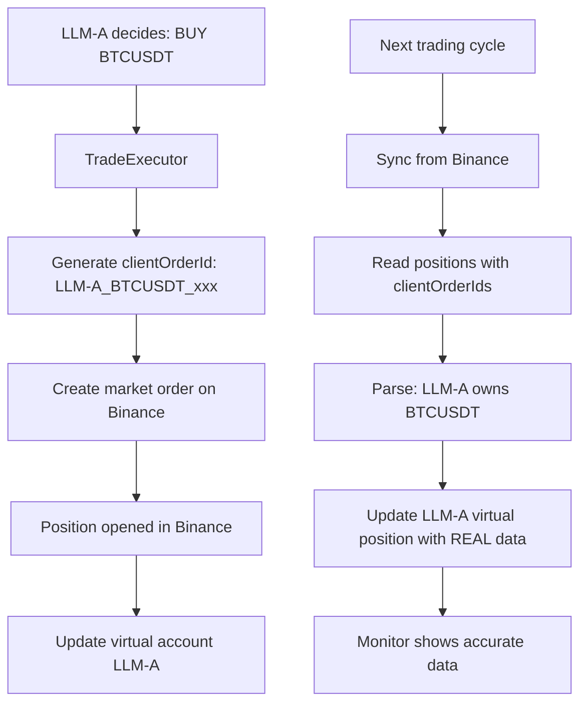

# 🔄 Binance Sync System - LLM Position Tracking

## Problema Solucionado

Antes de este sistema, había **desconexión total** entre:
- ✅ Posiciones REALES en Binance
- ❌ Posiciones virtuales en la base de datos

El monitor mostraba datos completamente diferentes a la realidad de Binance.

## Solución Implementada

### 1. **Client Order ID Tracking** 🏷️

Cada vez que un LLM abre una posición, se genera un `clientOrderId` único:

```
Format: {LLM_ID}_{SYMBOL}_{TIMESTAMP}
Example: LLM-A_BTCUSDT_1736630400000
```

Este ID permite identificar **qué LLM posee cada posición** en Binance.

### 2. **Sincronización Automática** 🔄

En cada ciclo de trading (Step 2):

1. **Leer posiciones de Binance** con `get_open_positions_with_client_ids()`
2. **Parsear clientOrderId** para determinar el LLM dueño
3. **Actualizar cuentas virtuales**:
   - ✅ Agregar posiciones nuevas encontradas en Binance
   - ✅ Actualizar cantidades/precios de posiciones existentes
   - ✅ Cerrar posiciones que ya no existen en Binance
4. **Sincronizar a Supabase**

### 3. **Tracking por LLM** 📊

Ahora cada posición se asigna **correctamente** a su LLM:

```
LLM-A: XRP LONG 100 @ $2.40
LLM-B: DOGE SHORT 500 @ $0.17
LLM-C: ADA LONG 200 @ $0.56
```

## Flujo Completo



## Archivos Modificados

### 1. `src/core/trade_executor.py`
- ✅ `_open_binance_position()`: Genera y pasa `clientOrderId`
- ✅ Formato: `{llm_id}_{symbol}_{timestamp}`

### 2. `src/clients/binance_client.py`
- ✅ `create_market_order()`: Acepta `newClientOrderId`
- ✅ `get_open_positions_with_client_ids()`: Lee posiciones con sus IDs
- ✅ Busca en órdenes recientes para obtener el clientOrderId

### 3. `src/services/account_service.py`
- ✅ `sync_from_binance()`:
  - Lee posiciones de Binance
  - Parsea clientOrderId
  - Asigna posiciones al LLM correcto
  - Actualiza cantidades reales
  - Sincroniza PnL

### 4. `src/services/trading_service.py`
- ✅ Step 2: Sincronización automática en cada ciclo
- ✅ Logs detallados por LLM

### 5. `src/api/dependencies.py`
- ✅ AccountService recibe BinanceClient

## Uso

### Probar Sincronización

```bash
# Ejecutar script de prueba
python3 scripts/test_sync.py
```

Esto mostrará:
- 📊 Posiciones REALES en Binance (con LLM owner)
- 💾 Posiciones virtuales BEFORE sync
- ⚡ Proceso de sincronización
- ✅ Posiciones virtuales AFTER sync
- 📈 Estadísticas por LLM

### Ejemplo de Output

```
BINANCE REAL POSITIONS
┌───────────┬──────────┬──────┬──────────┬─────────────┬──────────┬────────────────────┐
│ LLM Owner │ Symbol   │ Side │ Quantity │ Entry Price │ Leverage │ Client Order ID    │
├───────────┼──────────┼──────┼──────────┼─────────────┼──────────┼────────────────────┤
│ LLM-A     │ XRPUSDT  │ LONG │  49.9    │ $2.3998     │ 10x      │ LLM-A_XRPUSDT_17...│
│ LLM-B     │ DOGEUSDT │ LONG │ 1793.0   │ $0.172646   │ 10x      │ LLM-B_DOGEUSDT_1...│
└───────────┴──────────┴──────┴──────────┴─────────────┴──────────┴────────────────────┘

Sync Results
┌─────────────────────────────────────────────┐
│ ✓ Sync completed successfully               │
│                                              │
│ Total:                                       │
│   Positions synced: 2                        │
│   Positions added: 0                         │
│   Positions updated: 2                       │
│   Positions removed: 1                       │
│                                              │
│ By LLM:                                      │
│   [LLM-A]: 1 positions (+0 ~1 -0)           │
│   [LLM-B]: 1 positions (+0 ~1 -0)           │
│   [LLM-C]: 0 positions (+0 ~0 -1)           │
└─────────────────────────────────────────────┘
```

## Beneficios

### ✅ Competencia Real entre LLMs
Ahora se puede ver **exactamente** qué LLM está ganando:
```
Leaderboard:
🥇 LLM-B: $105.23 (+5.23%)
🥈 LLM-A: $102.15 (+2.15%)
🥉 LLM-C: $98.50 (-1.50%)
```

### ✅ Datos 100% Precisos
- Monitor muestra datos **idénticos** a Binance
- No más discrepancias en cantidades
- PnL calculado con precios reales

### ✅ Auto-Recuperación
Si el sistema se reinicia:
- Lee posiciones de Binance
- Reconstruye cuentas virtuales
- Asigna posiciones al LLM correcto
- **No se pierde información**

## Limitaciones Actuales

### Posiciones Manuales
Si abres una posición **manualmente** en Binance (sin el sistema):
- ❌ No tendrá clientOrderId del formato correcto
- ⚠️  Se ignorará en el sync

**Solución**: Siempre deja que los LLMs abran las posiciones.

### Posiciones Antiguas
Posiciones abiertas **antes** de implementar este sistema:
- ❌ No tienen clientOrderId con LLM_ID
- ⚠️  Se ignorarán en el sync

**Solución**: Cierra posiciones viejas manualmente y deja que los LLMs abran nuevas.

## Próximos Pasos

### Mejoras Futuras

1. **Fallback para posiciones sin clientOrderId**
   - Usar heurísticas (timing, cantidad)
   - Asignar al LLM más probable

2. **Persistir mapping en base de datos**
   - Guardar `position_id -> llm_id` en Supabase
   - Backup si clientOrderId falla

3. **Sub-cuentas de Binance**
   - Cuenta separada por LLM
   - Tracking 100% garantizado

## Testing

```bash
# 1. Probar sincronización
python3 scripts/test_sync.py

# 2. Iniciar un ciclo de trading
# (El LLM abrirá posiciones con clientOrderId)

# 3. Verificar en monitor
python3 scripts/monitor.py

# 4. Comparar con Binance web
# Debería coincidir exactamente
```

## Troubleshooting

### "Cannot determine LLM owner"
**Causa**: La posición no tiene un clientOrderId válido.
**Solución**:
- Cerrar la posición manualmente en Binance
- Dejar que el LLM la abra de nuevo

### Posiciones no se sincronizan
**Causa**: BinanceClient no está configurado en AccountService.
**Solución**: Verificar que `dependencies.py` pasa `binance_client` al crear AccountService.

### Cantidades no coinciden exactamente
**Causa**: Fees de Binance o redondeo.
**Solución**: Normal, pequeñas diferencias (<0.1%) son esperadas.

---

**🎉 Ahora tienes una competencia REAL entre LLMs con datos 100% precisos!**
